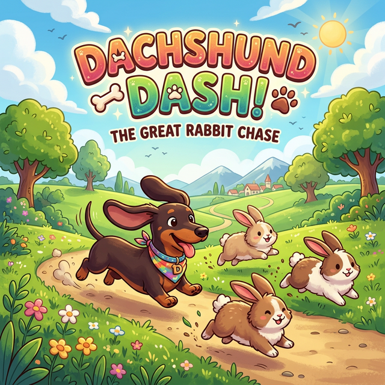

# 🐾 Dachshund Dash!

A vibrant, fast-paced 3D dachshund simulator built with **Three.js**. Chase fluffy rabbits across procedurally generated rolling hills, use your "Smell Vision" to track them down, and dash through the forest in this premium web game.



---

## 🚀 Live Site

This site is **powered by Netlify** ⚡️  
[](https://www.netlify.com)

You can visit our website at:  
➡️ https://dachshunddash.netlify.app/


## 🌟 Features

- **Dynamic 3D World**: Procedural hilly terrain with lush grass, trees, and fog.
- **Premium Dog Model**: A detailed dachshund with floppy ears, a wagging tail, and animated legs.
- **Advanced AI**: Fluffy rabbits that flee, zig-zag, and hide in burrows when you get close.
- **Smell Vision (Radar)**: A purple scent trail that guides you directly to the nearest rabbit.
- **Immersive Audio**: Real dachshund barks, rhythmic panting, idle whines, and "yikes!" squeaks from panicked bunnies.
- **Multiple Camera Angles**: Switch between a classic 3rd-person chase cam and an immersive 1st-person "Dog-o-Vision."
- **Cross-Platform Controls**: Play on Desktop with keyboard/mouse or on Mobile with responsive touch buttons.

## 🎮 How to Play

### Objectives
- You have **2 minutes** to catch as many rabbits as possible.
- Get close to a rabbit to "catch" it!

### Controls

| Action | Keyboard | Mouse | Mobile |
| :--- | :--- | :--- | :--- |
| **Move** | `W`/`S` | **Left-Click** (Run) | **▲** Button |
| **Steer** | `A`/`D` | **Move Mouse** | **◀** / **▶** Buttons |
| **Bark & Dash** | `Spacebar` | **Right-Click** | **BARK!** Button |
| **Toggle Camera** | `C` | - | - |
| **Audio Toggles** | - | On-Screen Buttons | On-Screen Buttons |

> [!TIP]
> **Bark & Dash!** Barking freezes nearby rabbits in fear for a moment and gives you a **1.6x speed boost** for 2 seconds. Use it to close the gap!

## 🛠️ Technical Setup

The game is built using:
- **Three.js**: For 3D rendering and scene management.
- **Web Audio API**: For spatial sound effects and background music.
- **Pointer Lock API**: For smooth, infinite mouse steering.

### Running Locally

1. Clone or download the repository.
2. Serve the directory using a local web server (required for module loading and audio assets).
   ```bash
   npx serve .
   ```
3. Open `http://localhost:3000` in your browser.

## 📂 Project Structure

- `index.html`: Entry point, UI layout, and styling.
- `js/`:
  - `main.js`: Scene setup, terrain generation, and game loop.
  - `Player.js`: Dog movement, animations, and input handling.
  - `Rabbit.js`: Rabbit AI and burrowing mechanics.
  - `Radar.js`: Smell-vision scent trail logic.
- `assets/`:
  - `audio/`: Local MP3 assets for barks, music, and environment sounds.
  - `splash.png`: Game splash screen.
  - `favicon.png`: Tab icon.

---

## 📜 License

All apps and code released under the **MIT License**, an [OSI‑approved open source license](https://opensource.org/licenses/MIT).  
See [LICENSE](./LICENSE) for details. You're welcome to play with and change this repo to suit your needs. 

---

*Created with ❤️ for Dachshund lovers everywhere!*
